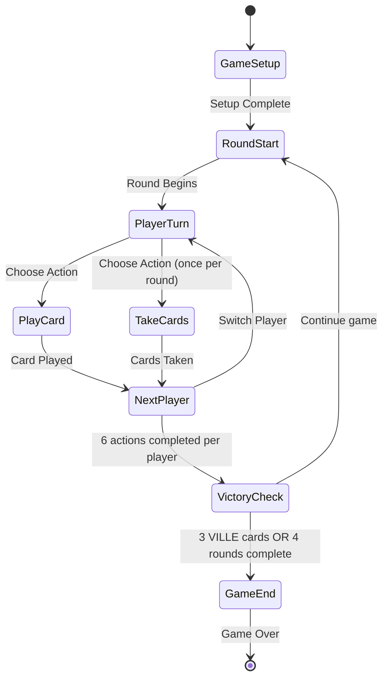
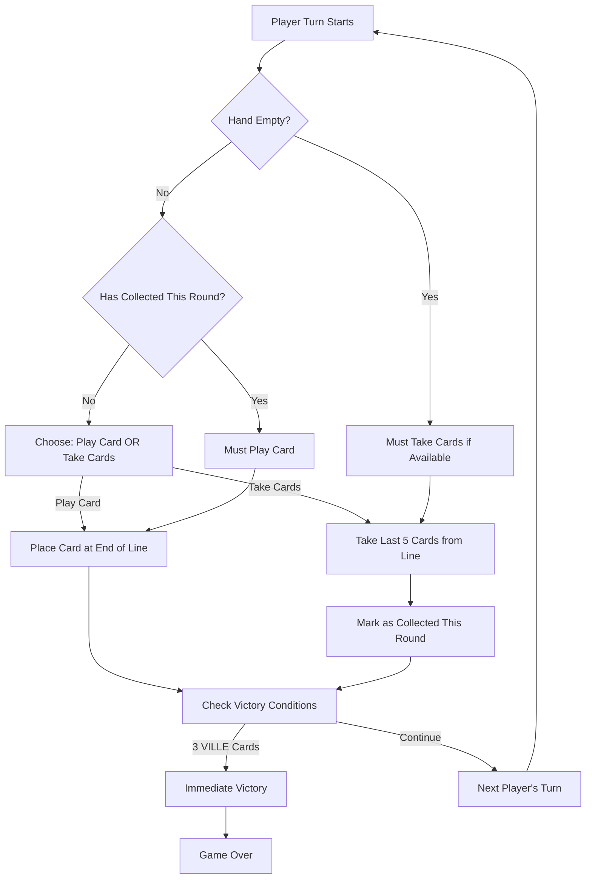
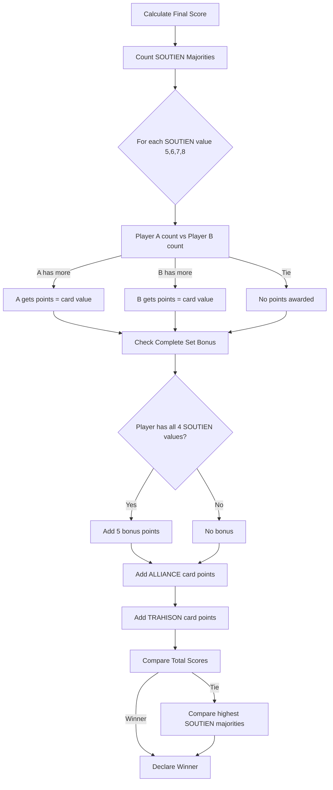
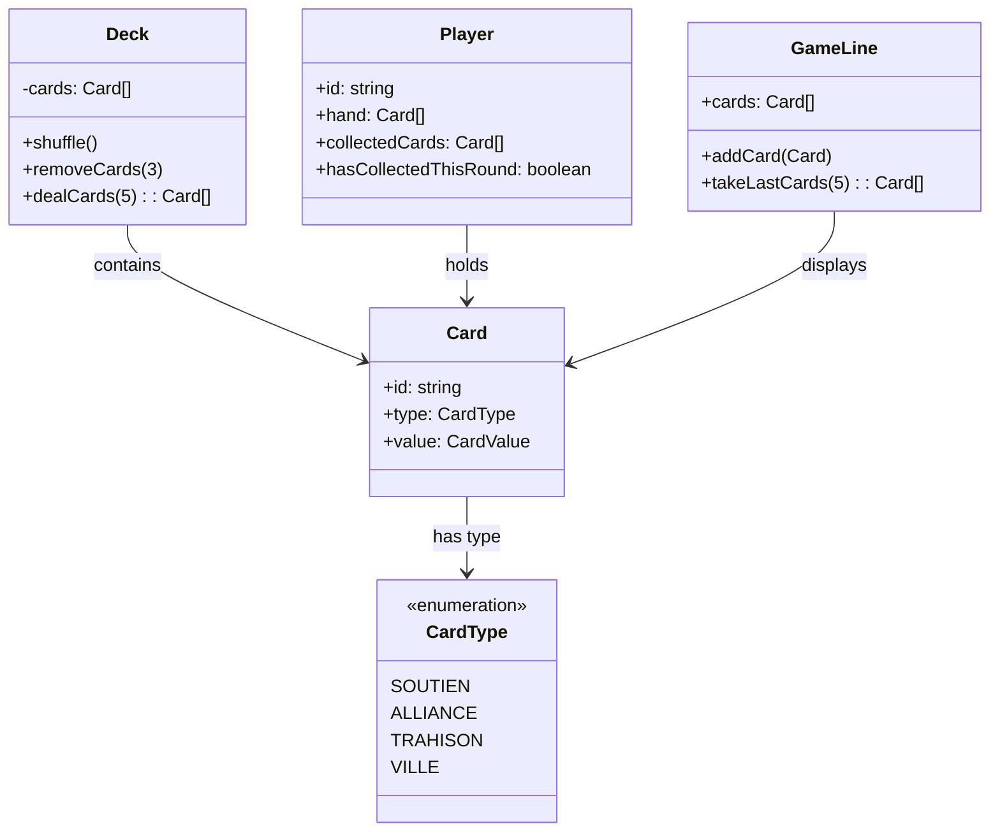

# District Noir - Game Rules

## Overview

District Noir is a tactical card game for 2 players set in an organized crime universe. Players compete for control of the noir district by collecting support cards and city cards.

## Game Objectives

- **Victory by Points**: Have more points than your opponent at the end of 4 rounds
- **Immediate Victory**: Control all three VILLE (City) cards simultaneously

## Game Components

- **45 game cards** (3 will be removed at the start of the game):
  - **26 SOUTIEN (Support) cards**: 5 cards of value 5, 6 cards of value 6, 7 cards of value 7, 8 cards of value 8
  - **7 ALLIANCE cards**: values 2, 3, or 4
  - **9 TRAHISON (Betrayal) cards**: values 1, 2, or 3
  - **3 VILLE (City) cards**: not counted in final scoring
- **2 double-sided HELP cards** (for information only)
- **1 double-sided CAMP token**

## Game Setup

1. Remove 3 random cards from the deck
2. Place 2 cards face up to form the initial line
3. Deal 5 cards to each player
4. Determine the first player with the CAMP token

## Game Structure

### Rounds

- A game lasts a maximum of 4 rounds
- Each round consists of:
  1. **Action Phase**: 6 turns per player
     - **PLAY A CARD** at the end of the line
     - **TAKE CARDS** (once per round)
  2. **End of Round Phase**:
     - Check victory conditions (3 VILLE cards)
     - If the game continues:
       - Deal 5 new cards to each player
       - Pass the CAMP token to the other player
       - Uncollected cards remain in the line

## Player Actions

On each turn, a player must choose one action:

### PLAY A CARD

- Place a card from your hand at the end of the line
- Mandatory action if your hand is not empty

### TAKE CARDS

- Take the last 5 cards from the line if possible
- If fewer than 5 cards are available, take all cards from the line
- Can only be done once per round
- After this action, the player must **PLAY CARDS** until the end of the round

## Victory Conditions

### 1. Immediate Victory

Control all 3 VILLE cards

### 2. Victory by Points (after 4 rounds)

- **SOUTIEN majority** = points equal to the card value
- **Set of 4 different SOUTIEN cards** = 5 bonus points
- **ALLIANCE and TRAHISON cards** = points equal to card value
- **Tiebreaker**: majority of highest value SOUTIEN cards

## Specific Rules

### Basic Rules

- Game for 2 players
- Deal 5 cards per player each round
- Cards in hand must first be played to the center
- Any card in the center can be collected by either player

### Action Rules

- **TAKE CARDS** limited to once per round
- 6 actions per player per round (5 PLAY + 1 TAKE)
- Collected cards are sorted by type in front of the player
- Collected cards are kept until the end of the game

### Round Rules

- A round ends when both players have performed their 6 actions
- Uncollected cards remain in line for the next round
- The CAMP token changes owner between rounds
- The game ends after 4 rounds or if a player controls all 3 VILLE cards

### End Game Rules

- Count SOUTIEN majorities
- Apply bonuses for complete sets
- Add ALLIANCE and TRAHISON points
- In case of tie, compare SOUTIEN majorities by decreasing value

## Scoring System

### SOUTIEN (Support) Cards

- **Majority Control**: If you have more SOUTIEN cards of a specific value than your opponent, you score points equal to that value
- **Complete Set Bonus**: If you collect all 4 different SOUTIEN values (5, 6, 7, 8), you gain 5 bonus points

### ALLIANCE Cards

- Score points equal to the card's value (2, 3, or 4 points)

### TRAHISON (Betrayal) Cards

- Score points equal to the card's value (1, 2, or 3 points)

### VILLE (City) Cards

- Do not provide points in final scoring
- Controlling all 3 provides immediate victory

## UML Diagrams

### Game State Diagram

### Turn System Flow

### Scoring System

### Card Distribution Diagram

## Game Flow Example

1. **Setup**: Remove 3 cards, place 2 in line, deal 5 to each player
2. **Round 1**: Players alternate playing cards and one player takes cards
3. **End of Round 1**: Check for 3 VILLE cards, deal new hands if continuing
4. **Rounds 2-4**: Repeat with remaining cards in line carrying over
5. **Final Scoring**: Calculate points from all collected cards

---

_In the largest criminal organizations of the city, men and women compete to grow their influence. Control of the Noir District, a highly contested area, is a major and essential issue for dominating the city._

_District Noir is a game that requires tactical thinking as you must manage your hand of cards as best as possible. The cards you have in hand are first placed in the center of the table and can therefore be collected by yourself or your opponent. You also need to have a sense of timing: which cards do I play and in what order? When do I collect cards? District Noir is also a game with risk-taking and bluffing. You'll need to try to get your opponent to make bad choices. Finally, there's real tension that builds because players can sometimes win immediately by gathering certain cards. But what remains most interesting is that you can experience this gameplay in games of only 15 minutes with extremely simple rules._
